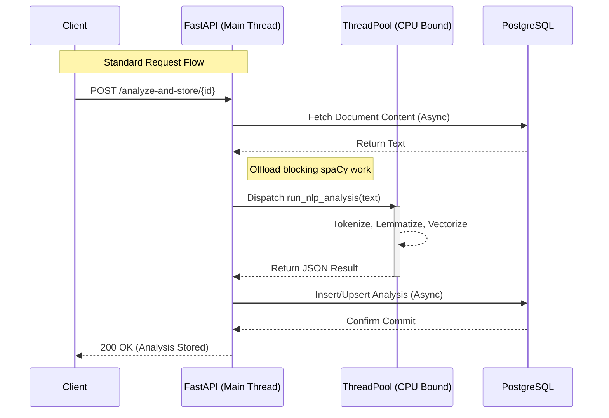
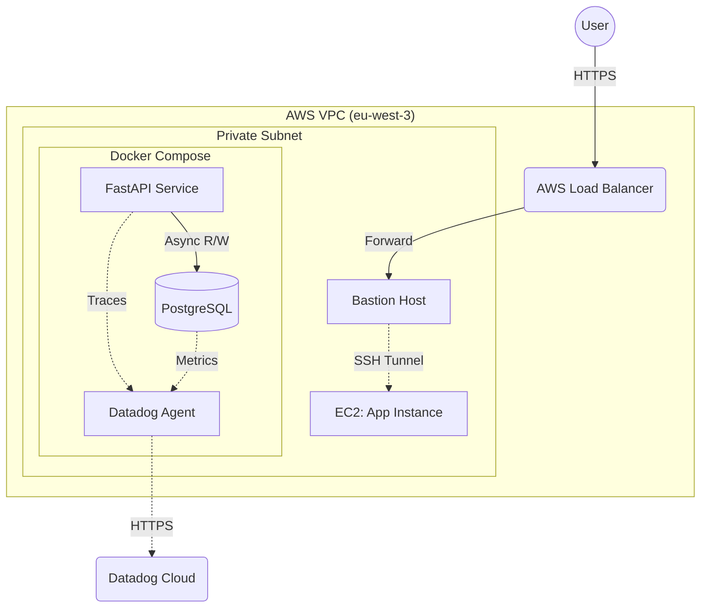
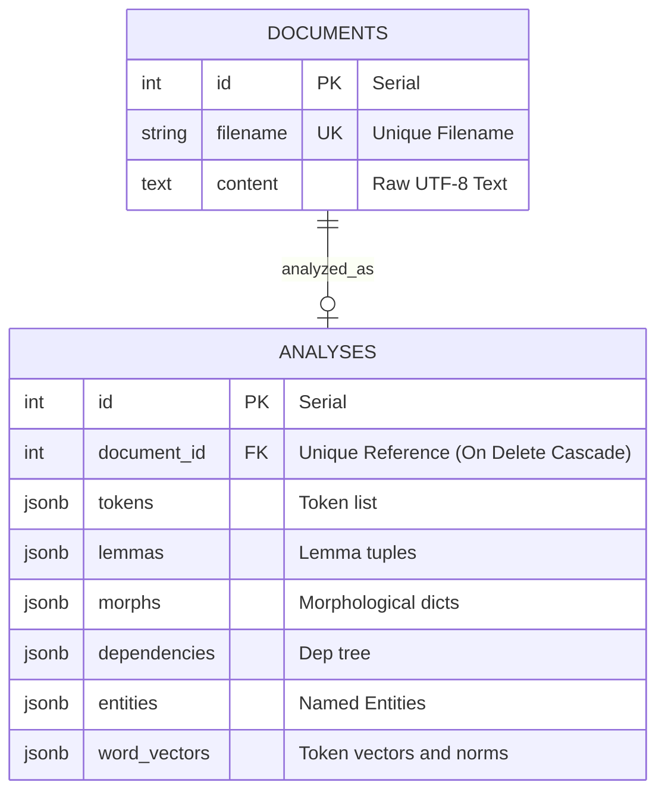
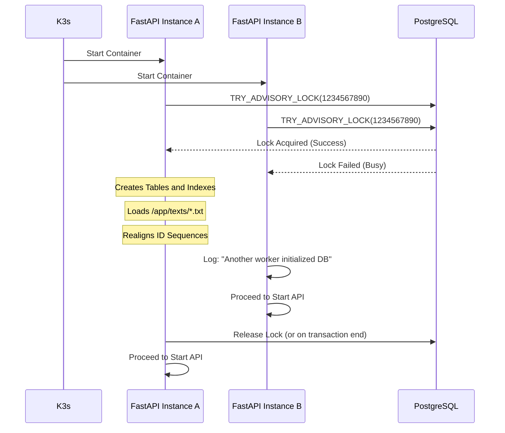

# The NLPipeline API Repository

## 1. Service Overview

```python
@app.get("/", response_class=JSONResponse, tags=['Endpoints'])
async def index():
    """
    Service metadata and endpoint discovery.
    """
    return {
        "service": "The NLPipeline API",
        "version": "1.0.0",
        "endpoints": {
            "GET /files": "List documents (id, filename)",
            "GET /files/{doc_id}": "View document content (JSON)",
            "POST /upload": "Upload a UTF-8 .txt file (form field 'file', optional 'filename')",
            "DELETE /files/{doc_id}": "Delete document (and its analysis via cascade)",
            "GET /download/{doc_id}.txt": "Download raw .txt file for document",
            "GET /analyze/{doc_id}": "Run transient analysis and return results (not stored)",
            "POST /analyze-and-store/{doc_id}": "Run analysis and store results in DB",
            "GET /analysis/{doc_id}": "Retrieve stored analysis (JSON)",
            "GET /download-analysis/{doc_id}.json": "Download stored analysis as .json file",
            "DELETE /analysis/{doc_id}": "Delete stored analysis for document",
        }
    }
```

This project implements a fully asynchronous NLP processing service designed for high throughput and production reliability. It integrates spaCy (`en_core_web_lg`) for deep linguistic analysis and PostgreSQL for persistent storage, orchestrated via FastAPI.



### Key Design Principles

* **Fully Async I/O**: Database and HTTP operations are non-blocking, with CPU-bound NLP tasks explicitly offloaded to thread pools to maintain event loop vitality.

* **Resource Efficiency**: Implements a single-load lifecycle for the spaCy model (singleton pattern) to minimize memory footprint in containerized environments.

* **Explicit SQL**: Deliberately avoids ORM models in favor of explicit SQLAlchemy Core queries for predictable performance, clear transactional boundaries, and easier debugging.

* **Production Hardened**: Includes safe concurrent startup hooks (DB readiness checks and advisory locks) and graceful shutdown procedures.

* **Observability**: Built-in Datadog APM auto-instrumentation via `ddtrace`.

### Tech Stack

* **Core**: Python 3.9+, FastAPI, Uvicorn

* **NLP**: spaCy (`en_core_web_lg`)

* **Database**: PostgreSQL, Async SQLAlchemy + asyncpg

* **Observability**: Datadog (`ddtrace` patched)

* **Infrastructure**: Docker, Kubernetes (Helm/K3s), Terraform (AWS)

## 2. API Endpoints Reference

| Method | Endpoint                         | Description                                                      |
|--------|----------------------------------|------------------------------------------------------------------|
| GET    | /files                           | List documents (id, filename)                                    |
| GET    | /files/{doc_id}                  | View document content (JSON)                                     |
| POST   | /upload                          | Upload a .txt file (collision-safe naming)                       |
| DELETE | /files/{doc_id}                  | Delete document and cascade delete analysis                        |
| GET    | /download/{doc_id}.txt           | Download raw text file                                           |
| GET    | /analyze/{doc_id}                | Run transient analysis (tokens, lemmas, morphs, vectors)         |
| POST   | /analyze-and-store/{doc_id}      | Run analysis and commit to DB (idempotent upsert)                |
| GET    | /analysis/{doc_id}               | Retrieve stored analysis                                         |
| GET    | /download-analysis/{doc_id}.json | Download stored analysis as .json file                           |
| DELETE | /analysis/{doc_id}               | Delete stored analysis                                           |

## 3. Testing Phase with the pytest Framework

Run the test suite using a dedicated Docker Compose environment to ensure isolation from production data.

### Prerequisites

* Git

* Docker and Docker Compose

### Configuration and Environment Variables

Create a `.env` file in the root directory with the following variables:

| Variable          | Description                              | Required | Default / Example                     |
|-------------------|------------------------------------------|----------|---------------------------------------|
| POSTGRES_USER     | Database username                        | Yes      | user                                  |
| POSTGRES_PASSWORD | Database password                        | Yes      | password                              |
| POSTGRES_DB       | Database name                            | Yes      | nlpdb                                 |
| DD_API_KEY        | Datadog API Key for APM                  | No       | (Empty if not using Datadog)          |

### Execution Steps

```bash
# 1. Clone the repository
git clone https://github.com/AG7-ES/nlp-pipeline-repo.git

# 2. Navigate to the TESTING directory
cd nlp-pipeline-repo/testing

# 3. Create and configure the .env file
touch .env
nano .env

# Add the required environment variables (example content):
# .env
POSTGRES_USER=your_postgres_user
POSTGRES_PASSWORD=your_postgres_password
POSTGRES_DB=your_postgres_db

# 4. Build and start the test services with Docker Compose in detached mode
docker compose -f docker-compose.test.yaml up --build -d

# 5. Check the status of running test services
docker compose -f docker-compose.test.yaml ps

# 6. View logs for a specific test service (replace SERVICE_NAME with the actual test service name)
docker compose -f docker-compose.test.yaml logs -f SERVICE_NAME

# 7. Test the API endpoint to ensure the test service is running
curl -v http://localhost:8001/

# 8. Enter the running container for the test service
docker exec -it nlp_test_fastapi bash

# 9. Run the tests using pytest
pytest -v /app/tests/

# 10. Exit the test container
exit

# 11. Stop all running test services and remove the containers (when done)
docker compose -f docker-compose.test.yaml down
```

## 4. Building, Pushing and Inspecting the Docker Image

Instructions for building the production image and pushing to Docker Hub.

```bash
# 1. Clone the repository
git clone https://github.com/AG7-ES/nlp-pipeline-repo.git

# 2. Navigate to the FastAPI app directory
cd nlp-pipeline-repo/fastapi_app

# 3. Log in to Docker Hub (you'll be prompted for your credentials)
docker login

# 4. Build the Docker image locally
docker build -t DOCKERHUB_USERNAME/IMAGE_NAME:IMAGE_TAG .

# 5. Push the Docker image to Docker Hub
docker push DOCKERHUB_USERNAME/IMAGE_NAME:IMAGE_TAG

# 6. Inspect the Docker image to view details about it
docker inspect DOCKERHUB_USERNAME/IMAGE_NAME:IMAGE_TAG
```

## 5. Local Orchestration (Docker Compose)

Run the full stack (App, DB, Datadog Agent) locally.

```bash
# 1. Clone the repository and navigate to the project directory
git clone https://github.com/AG7-ES/nlp-pipeline-repo.git
cd nlp-pipeline-repo

# 2. Create and configure the .env file
touch .env
nano .env

# Add the required environment variables (example content):
# .env
POSTGRES_USER=your_postgres_user
POSTGRES_PASSWORD=your_postgres_password
POSTGRES_DB=your_postgres_db
DD_API_KEY=your_datadog_api_key

# 3. Build and start the services with Docker Compose in detached mode
docker compose up --build -d

# 4. Check the status of running services
docker compose ps

# 5. View logs for a specific service (replace SERVICE_NAME with the actual service name)
docker compose logs SERVICE_NAME

# 6. Test the API endpoint to ensure the service is running
curl -v http://localhost:8000/

# 7. Check Datadog APM traces (if Datadog APM is enabled)
# Visit the Datadog APM dashboard to view the application's performance and traces
# URL: https://app.datadoghq.eu/apm/traces

# 8. Stop all running services and remove the containers (when done)
docker compose down
```

## 6. Kubernetes Orchestration

It is possible to deploy using either raw manifests or Helm Charts.

### Option A: Deployment via K3s Manifests

Ideal for simple clusters or debugging raw YAML configurations.

```bash
git clone https://github.com/AG7-ES/nlp-pipeline-repo.git
cd nlp-pipeline-repo/k3s_manifests

# 1. Setup Namespace and Secret
kubectl create namespace nlp-pipeline
kubectl create secret generic datadog-secret \
  --from-literal=DD_API_KEY=<your-real-key> \
  -n nlp-pipeline

# 2. Apply Manifests
kubectl apply -f . -n nlp-pipeline

# 3. Check the status of all resources in the namespace
kubectl get all -n nlp-pipeline

# 4. View logs of a specific resource
kubectl logs ITEM_NAME -n nlp-pipeline

# 5. Access (Port Forwarding)
# If Ingress is not configured:
kubectl port-forward svc/fastapi-service 8000:80 -n nlp-pipeline
# Visit: http://localhost:8000/

# 6. Check Datadog APM traces (if Datadog APM is enabled)
# Visit the Datadog APM dashboard to view the application's performance and traces
# URL: https://app.datadoghq.eu/apm/traces

# 7. Clean up all resources (when done)
kubectl delete namespace nlp-pipeline
```

### Option B: Deployment via Helm

Recommended for production deployments to manage complexity and dependencies.

```bash
git clone https://github.com/AG7-ES/nlp-pipeline-repo.git
cd nlp-pipeline-repo

# 1. Setup Namespace and Secret
kubectl create namespace nlp-pipeline
kubectl create secret generic datadog-secret \
  --from-literal=DD_API_KEY=<your-real-key> \
  -n nlp-pipeline

# 2. Lint Charts
helm lint helm_charts/app/nlp-pipeline
helm lint helm_charts/infra/cert-manager
helm lint helm_charts/infra/datadog

# 3. Install Infrastructure
# Cert-Manager
helm upgrade --install cert-manager-issuer helm_charts/infra/cert-manager --atomic
# Datadog Agent
helm upgrade --install datadog-agent helm_charts/infra/datadog --namespace nlp-pipeline --atomic

# 4. Install Application
helm upgrade --install nlp-pipeline helm_charts/app/nlp-pipeline --namespace nlp-pipeline --atomic

# 5. Verify Release
helm status nlp-pipeline -n nlp-pipeline

# 6. Uninstall
helm uninstall nlp-pipeline -n nlp-pipeline
kubectl delete namespace nlp-pipeline
```

## 7. Cloud Infrastructure (Terraform and AWS)

Automates the provisioning of AWS EC2 instances, networking, and security groups to host the Docker Compose deployment.



### 7.1. Configuration

Navigate to `terraform/` and create a `terraform.tfvars` file:

```hcl
my_ip             = "<YOUR_PUBLIC_IP>/32" # Use `curl -4 ifconfig.me`
dd_api_key        = "<YOUR_DATADOG_API_KEY>"
postgres_user     = "postgres"
postgres_password = "securepassword"
postgres_db       = "nlpdb"
```

### 7.2. Deployment

```bash
cd nlp-pipeline-repo/terraform

# Initialize and Apply
terraform init
terraform validate
terraform plan
terraform apply --auto-approve
```

### 7.3. Access and Verification

```bash
# 1. Extract SSH Key
terraform output -raw private_key_pem > nlp-key.pem
chmod 400 nlp-key.pem

# 2. Access via Load Balancer
ALB_URL=$(terraform output -raw alb_dns_name)
curl -k https://$ALB_URL/

# 3. SSH Tunneling (Bastion -> Private App Instance)
ssh-add nlp-key.pem
BASTION_IP=$(aws ec2 describe-instances --filters "Name=tag:Name,Values=bastion-host" "Name=instance-state-name,Values=running" --query "Reservations[*].Instances[*].PublicIpAddress" --output text --region eu-west-3)

ssh -A ubuntu@$BASTION_IP
# From Bastion, jump to app instance:
ssh ubuntu@<PRIVATE_IP_OF_APP_INSTANCE>

# Check containers and logs of services on remote host
sudo docker ps
sudo docker compose logs -f <SERVICE_NAME>
sudo docker compose logs -f <SERVICE_NAME>
sudo docker compose logs -f <SERVICE_NAME>
```

### 7.4. Destruction

```bash
terraform destroy --auto-approve
```

## 8. Database Schema and Data Modeling

The system uses a relational schema with JSONB columns for NLP results, ensuring both structure and flexibility for high-dimensional data like word vectors.



## 9. Resilient Startup Lifecycle

In high-availability environments (Kubernetes/Replicas), multiple API containers may start simultaneously. The pipeline uses PostgreSQL Advisory Locks to ensure that schema creation and initial corpus loading happen exactly once, preventing race conditions.



## 10. Document Ingestion Logic

The `db_loader.py` module facilitates "Infrastructure as Data":

* Mounting: Put the `.txt` files in a folder and mount it to `/app/texts` in the container.

* Idempotency: The loader uses `ON CONFLICT (filename) DO UPDATE`, initial documents can be updated by simply changing the source files and restarting the containers.

* Sequence Alignment: Automatically fixes PostgreSQL `SERIAL` counters after manual or bulk inserts to prevent `Key (id)=(X) already exists` errors.

## 11. Resource Requirements and Scaling

Because this API loads the `en_core_web_lg` (Large) spaCy model into memory, its resource profile is significantly different from a standard "lightweight" microservice.

### Memory Footprint

* Idle (Model Loaded): From around 800 MB to 1.1 GB RAM.

* During Heavy Analysis: Can spike to 1.5 GB and more depending on document size.

* Storage: The Docker image uses around 2.0 GB of disk space due to the pre-installed spaCy model and dependencies. The actual content size is around 600 MB.

### Kubernetes Resource Specs (Recommended)

If the container restarts, ensure memory limits are at least 1.5GB to accommodate the spaCy model. To prevent `OOMKilled` (Out of Memory) errors, use these limits in your `deployment.yaml`:

```yaml
resources:
  requests:
    memory: "1Gi"
    cpu: "500m"
  limits:
    memory: "2Gi"
    cpu: "1000m"
```

### Scaling Strategy

* CPU vs. Memory: Analysis is CPU-bound, but the model footprint is a fixed Memory cost.

* HPA (Horizontal Pod Autoscaler): Scale based on CPU utilization (e.g., 70%). Scaling based on memory is not recommended here because memory remains high/static once the model is loaded.

* Concurrency: We use asyncio.to_thread to prevent the event loop from blocking. For production, we recommend 2-4 workers per container (managed via Gunicorn/Uvicorn workers) to utilize multiple cores.

### 12. Troubleshooting and FAQ

Q: The container is stuck at "Waiting for database..."

* Check: Ensure the `db` service in `docker-compose` or the `postgres-service` in K3s is reachable.

* Logs: `kubectl logs <pod-name> -n nlp-pipeline`.

Q: I get a `Key (id)=(X) already exists` error during upload.

* Cause: This usually happens if documents were manually inserted into the DB without updating the sequence.

* Fix: Restart the API. The `db_loader.py` script automatically runs `_set_documents_sequence()` on startup to align the PostgreSQL counters.

Q: How do I update the initial text corpus?

* Action: Update the files in your local `text_db/texts` folder and restart the stack. The `ON CONFLICT` logic in the loader will refresh the content in the database without creating duplicates.